# 物品复活系统完整设计与开发文档

**文档版本**：V1.0

**编写日期**：2025年12月01日

**适用范围**：物品复活系统开发、测试、演示及维护

**编写目的**：本文档详细描述物品复活系统的需求分析、设计方案、实现细节、使用说明及开发总结，为系统开发、测试、演示及后续优化提供依据。

# 一、系统概述

## 1.1 项目背景

大学生群体中普遍存在闲置物品堆积问题，许多物品扔掉可惜、留存又占用空间。为解决这一痛点，设计开发物品复活系统，为用户提供闲置物品的赠送、售卖信息发布与查询渠道，实现资源循环利用，践行绿色环保理念。

## 1.2 核心功能

系统支持用户注册审核、物品分类管理、物品信息增删查改、多条件物品搜索等核心功能，区分管理员与普通用户权限，提供友好的GUI操作界面，满足不同用户的使用需求。

## 1.3 技术栈

- 开发语言：Python 3.6+

- GUI框架：Tkinter（原生内置，无需额外安装，跨平台兼容性好）

- 数据存储：JSON文件（轻量便捷，适合小型系统数据持久化）

- 开发工具：PyCharm（或其他Python IDE）

# 二、需求分析

## 2.1 功能性需求

### 2.1.1 用户管理模块

- 普通用户：注册（填写姓名、住址、联系方式等基本信息）、登录、查看个人信息、退出登录

- 管理员：登录、审核普通用户注册申请、管理物品类型（新增、修改）、退出登录

### 2.1.2 物品类型管理模块

- 管理员可定义物品类型名称及对应额外属性（如食品类含保质期、数量；书籍类含作者、出版社）

- 管理员可修改已存在的物品类型名称及属性

- 系统默认提供食品、书籍、工具三类基础类型

### 2.1.3 物品管理模块

- 添加物品：普通用户选择物品类型后，填写公共信息（名称、说明、所在地址、联系人手机、邮箱）及该类型额外属性

- 删除物品：普通用户可删除自己发布的物品信息

- 显示物品：系统展示物品列表，包含物品ID、名称、类型、联系人、地址等关键信息

- 搜索物品：普通用户先选择物品类型，再输入关键字，可在物品名称和说明中匹配查询

## 2.2 非功能性需求

- 易用性：GUI界面简洁直观，操作流程清晰，符合用户使用习惯

- 兼容性：支持Windows、MacOS、Linux等主流操作系统

- 稳定性：数据存储安全可靠，操作过程中无频繁崩溃或数据丢失问题

- 可扩展性：代码结构模块化，便于后续添加功能（如物品交易聊天、订单管理等）

## 2.3 约束条件

- 开发周期：需在16周前完成开发并提交至Github仓库

- 演示要求：1月7日（17周周二）进行演示，包含文档讲解及功能实操

- 技术约束：仅限使用Python语言实现，需提供清晰的代码注释

# 三、系统设计

## 3.1 整体架构设计

系统采用模块化架构设计，分为数据模型层、数据访问层、界面交互层，各层职责清晰，降低耦合度，便于维护与扩展。

- 数据模型层（models.py）：定义用户、物品类型、物品核心实体类，封装实体属性及数据转换方法

- 数据访问层（database.py）：实现数据的加载、保存、更新、查询等操作，负责与JSON数据文件交互

- 界面交互层（gui.py）：基于Tkinter实现GUI界面，处理用户交互操作，调用数据访问层接口完成业务逻辑

- 主程序入口（main.py）：初始化系统环境，启动GUI应用

## 3.2 用例模型

【此处预留用例模型内容，后续补充】

### 3.2.1 参与者

- 普通用户：系统核心使用群体，负责发布、管理、查询闲置物品

- 管理员：负责用户审核、物品类型管理，保障系统有序运行

### 3.2.2 核心用例清单

|用例ID|用例名称|参与者|用例描述|
|---|---|---|---|
|UC001|用户注册|普通用户|填写姓名、住址、联系方式等信息完成注册，等待管理员审核|
|UC002|用户登录|普通用户/管理员|输入用户名和密码，验证通过后进入系统主界面|
|UC003|审核用户|管理员|查看待审核用户列表，审核通过后普通用户方可正常使用系统|
|UC004|管理物品类型|管理员|新增物品类型（含属性定义）、修改已有物品类型信息|
|UC005|添加物品|普通用户|选择物品类型，填写公共信息及额外属性，发布物品信息|
|UC006|删除物品|普通用户|选择自己发布的物品，确认后删除该物品信息|
|UC007|搜索物品|普通用户|选择物品类型，输入关键字，查询匹配的物品列表|
|UC008|查看物品列表|普通用户/管理员|在系统主界面查看所有符合条件的物品信息，包含关键属性展示|
### 3.2.3 用例图

参与者（普通用户、管理员）与用例之间的关联关系如下：

- 普通用户关联用例

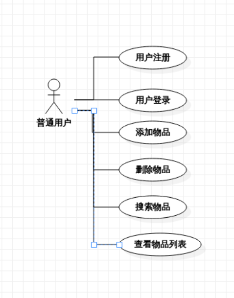

- 管理员关联用例

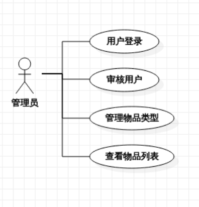


## 3.3 各用例顺序图

### 3.3.1 用例UC001：用户注册顺序图
1. 用户 → GUI：点击“注册”按钮  
2. GUI → 用户：展示注册表单  
3. 用户 → GUI：填写注册信息（用户名、密码、姓名等）并提交  
4. GUI → 数据库：验证用户名是否已存在  
5. 数据库 → GUI：返回用户名验证结果  
6. GUI → 数据库：保存用户注册信息（状态为待审核）  
7. 数据库 → GUI：返回保存成功  
8. GUI → 用户：提示“注册成功，请等待管理员审核”  

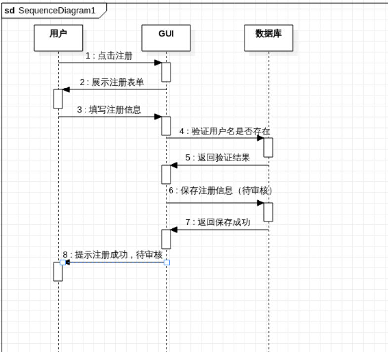

### 3.3.2 用例UC002：用户登录顺序图
1. 用户 → GUI：输入用户名和密码，点击“登录”按钮  
2. GUI → 数据库：请求验证用户信息  
3. 数据库 → GUI：返回用户信息及状态（是否审核通过）  
4. GUI → 用户：验证失败则提示错误；验证成功则进入系统主界面  

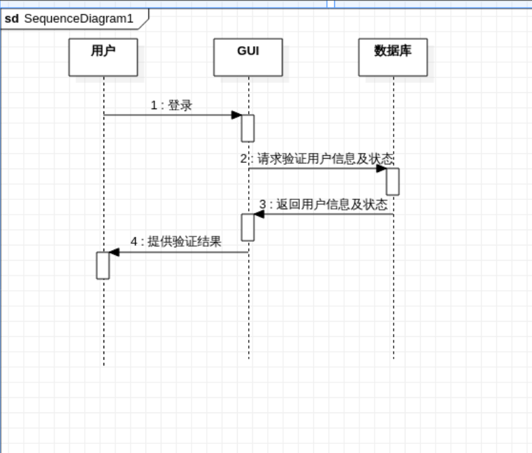

### 3.3.3 用例UC003：审核用户顺序图
1. 管理员 → GUI：点击“审核用户”菜单  
2. GUI → 数据库：请求待审核用户列表  
3. 数据库 → GUI：返回待审核用户数据  
4. GUI → 管理员：展示待审核用户列表  
5. 管理员 → GUI：选择用户并点击“审核通过”  
6. GUI → 数据库：更新用户审核状态（is_approved=True）  
7. 数据库 → GUI：返回更新成功  
8. GUI → 管理员：提示“审核成功”并刷新列表  

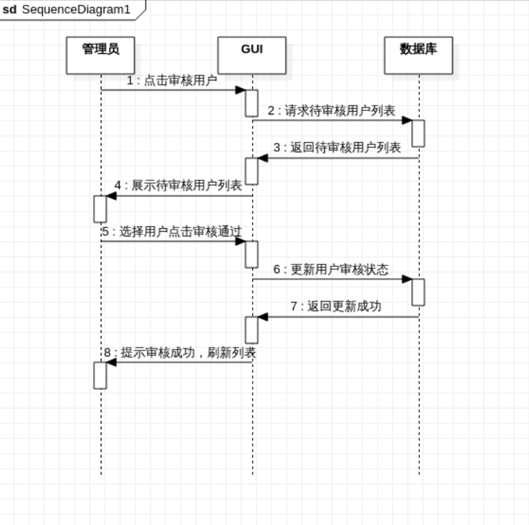

### 3.3.4 用例UC004：管理物品类型顺序图（新增类型）
1. 管理员 → GUI：点击“管理物品类型”菜单  
2. GUI → 管理员：展示物品类型管理界面  
3. 管理员 → GUI：点击“添加类型”，输入类型名称及属性  
4. GUI → 数据库：保存新物品类型信息  
5. 数据库 → GUI：返回保存成功  
6. GUI → 管理员：提示“类型添加成功”并刷新类型列表  

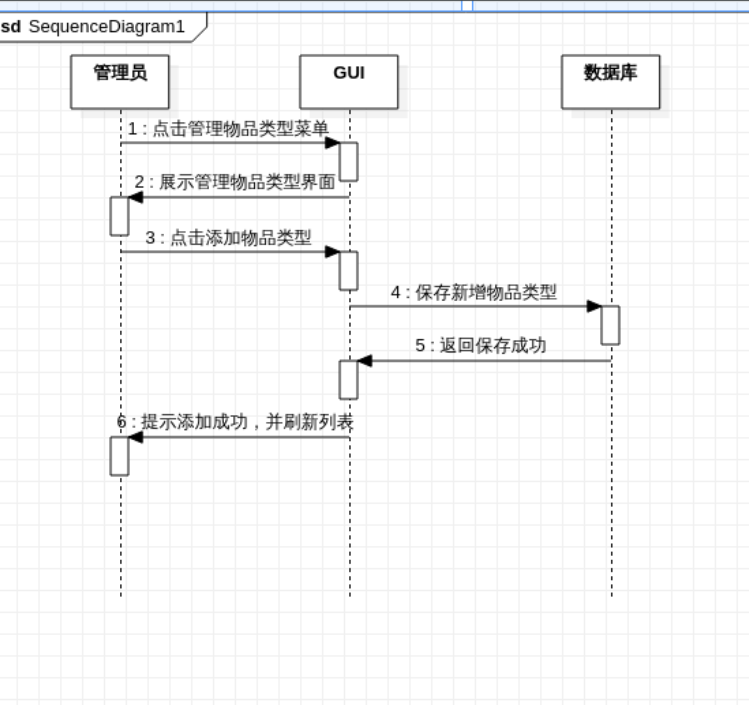

### 3.3.5 用例UC005：添加物品顺序图
1. 用户 → GUI：点击“添加物品”按钮  
2. GUI → 数据库：请求物品类型列表  
3. 数据库 → GUI：返回物品类型  
4. GUI → 用户：展示类型选择界面  
5. 用户 → GUI：选择物品类型  
6. GUI → 数据库：请求该类型属性信息  
7. 数据库 → GUI：返回类型属性  
8. GUI → 用户：展示物品信息填写表单  
9. 用户 → GUI：提交表单数据  
10. GUI → 数据库：保存物品信息  
11. 数据库 → GUI：返回保存成功  
12. GUI → 用户：提示“物品添加成功”并刷新列表  

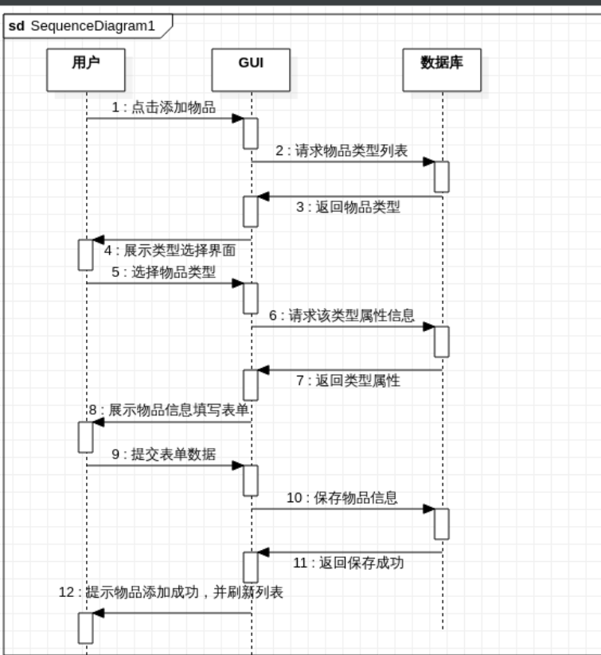

### 3.3.6 用例UC006：删除物品顺序图
1. 用户 → GUI：在物品列表选择待删除物品，点击“删除”按钮  
2. GUI → 用户：弹出确认删除提示框  
3. 用户 → GUI：确认删除  
4. GUI → 数据库：删除该物品信息  
5. 数据库 → GUI：返回删除成功  
6. GUI → 用户：提示“删除成功”并刷新物品列表  

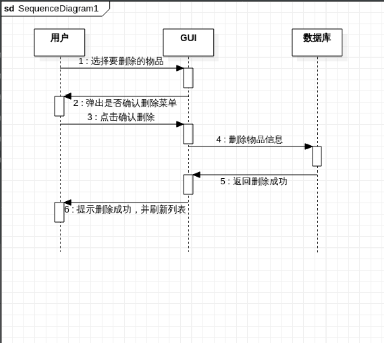

### 3.3.7 用例UC007：搜索物品顺序图
1. 用户 → GUI：选择物品类型，输入关键字，点击“搜索”按钮  
2. GUI → 数据库：根据类型和关键字查询物品  
3. 数据库 → GUI：返回匹配的物品列表  
4. GUI → 用户：展示搜索结果列表  

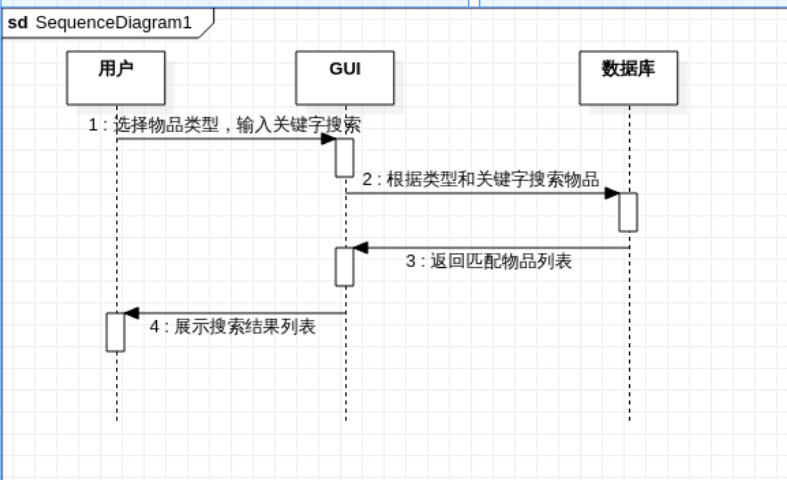

### 3.3.8 用例UC008：查看物品列表顺序图
1. 用户/管理员 → GUI：进入系统主界面  
2. GUI → 数据库：请求所有物品列表  
3. 数据库 → GUI：返回物品数据  
4. GUI → 用户/管理员：展示物品列表信息  

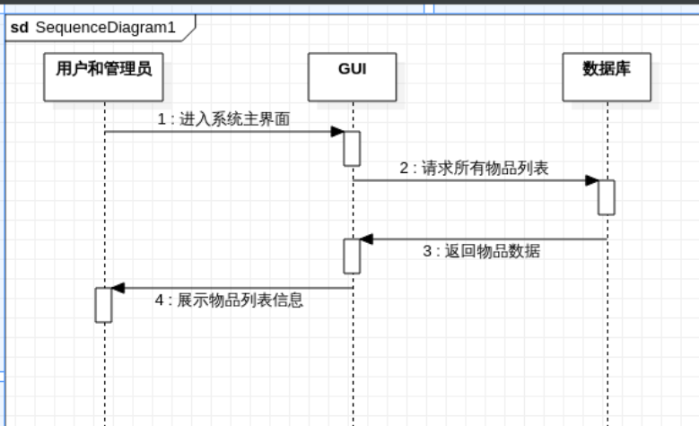

## 3.4 类图

系统核心类包括User（用户类）、ItemType（物品类型类）、Item（物品类）、Database（数据库操作类）、ItemResurrectionGUI（GUI界面类），各类属性及方法如下：

### 3.4.1 User类

- 属性：username（用户名，字符串）、password（密码，字符串）、name（真实姓名，字符串）、address（住址，字符串）、phone（联系电话，字符串）、email（邮箱，字符串）、is_admin（是否为管理员，布尔值）、is_approved（是否审核通过，布尔值）

- 方法：to_dict() → 将User对象转换为字典，用于数据存储

### 3.4.2 ItemType类

- 属性：name（类型名称，字符串）、attributes（额外属性列表，列表）

- 方法：to_dict() → 将ItemType对象转换为字典，用于数据存储

### 3.4.3 Item类

- 属性：id（物品ID，字符串，默认用时间戳生成）、name（物品名称，字符串）、description（物品说明，字符串）、address（所在地址，字符串）、contact_phone（联系人手机，字符串）、contact_email（联系人邮箱，字符串）、item_type（物品类型，字符串）、user（发布用户，字符串）、extra_attributes（额外属性，字典）

- 方法：to_dict() → 将Item对象转换为字典，用于数据存储

### 3.4.4 Database类

- 属性：db_file（数据文件路径，字符串，默认"database.json"）、data（内存数据，字典，包含users、item_types、items三个列表）

- 方法：
        load_data() → 从JSON文件加载数据到内存

- save_data() → 将内存数据保存到JSON文件

- 用户相关：add_user()（添加用户）、get_user()（获取单个用户）、update_user()（更新用户信息）、get_pending_users()（获取待审核用户）

- 物品类型相关：add_item_type()（添加物品类型）、get_item_types()（获取所有类型）、get_item_type()（获取单个类型）、update_item_type()（更新类型信息）

- 物品相关：add_item()（添加物品）、get_items()（获取物品列表，支持类型和关键字筛选）、get_item()（获取单个物品）、delete_item()（删除物品）

### 3.4.5 ItemResurrectionGUI类

- 属性：root（主窗口对象）、db（Database对象）、current_user（当前登录用户，字典）

- 方法：
        界面创建：create_login_interface()（创建登录界面）、create_main_interface()（创建主界面）、clear_interface()（清空界面）

- 用户操作：login()（登录验证）、register()（用户注册）、logout()（退出登录）、show_user_info()（显示个人信息）、approve_users()（审核用户）

- 物品类型管理：manage_item_types()（管理类型界面）、edit_item_type()（编辑类型）

- 物品操作：add_item()（添加物品）、delete_item()（删除物品）、search_items()（搜索物品）、load_items()（加载物品列表）

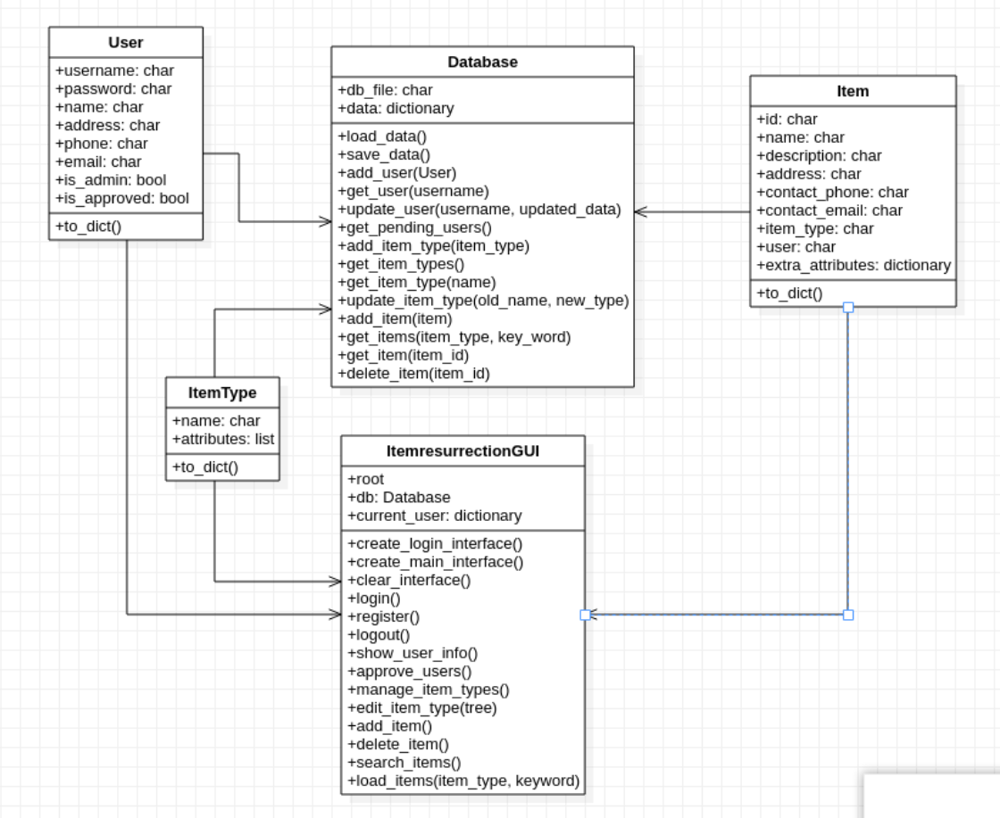

# 四、实现细节

## 4.1 项目结构

```plaintext

item_resurrection_system/
├── main.py               # 主程序入口，初始化系统并启动GUI
├── models.py             # 定义User、ItemType、Item核心数据模型
├── gui.py                # 实现GUI界面及用户交互逻辑
├── database.py           # 实现数据的加载、保存及各类查询更新操作
├── database.json         # 数据存储文件（程序运行后自动生成）
└── README.md             # 系统使用说明及项目概述

```

## 4.2 关键功能实现

### 4.2.1 数据持久化

采用JSON文件存储数据，Database类的load_data()方法在初始化时加载数据，save_data()方法在每次数据修改后保存，确保数据持久化。示例代码片段：

```python

def save_data(self):
    """保存数据到JSON文件"""
    with open(self.db_file, 'w', encoding='utf-8') as f:
        json.dump(self.data, f, ensure_ascii=False, indent=2)

def load_data(self):
    """从JSON文件加载数据"""
    if os.path.exists(self.db_file):
        try:
            with open(self.db_file, 'r', encoding='utf-8') as f:
                self.data = json.load(f)
        except:
            # 若文件损坏，初始化空数据
            self.data = {'users': [], 'item_types': [], 'items': []}
    else:
        self.data = {'users': [], 'item_types': [], 'items': []}
```

### 4.2.2 用户权限控制

通过User类的is_admin和is_approved字段实现权限控制。登录时验证用户是否审核通过，主界面根据is_admin字段显示不同菜单（管理员额外显示"管理"菜单）。示例代码片段：

```python

# 登录验证
if not user['is_approved']:
    messagebox.showinfo("提示", "您的账号正在审核中，请等待管理员批准！")
    return

# 管理员菜单显示
if self.current_user and self.current_user.get('is_admin'):
    admin_menu = tk.Menu(menubar, tearoff=0)
    admin_menu.add_command(label="审核用户", command=self.approve_users)
    admin_menu.add_command(label="管理物品类型", command=self.manage_item_types)
    menubar.add_cascade(label="管理", menu=admin_menu)
```

### 4.2.3 物品类型动态表单

根据选择的物品类型动态生成额外属性表单，通过simpledialog弹出输入框获取用户输入，存储为字典格式。示例代码片段：

```python

# 获取额外属性
item_type = self.db.get_item_type(selected_type)
extra_attributes = {}

for attr in item_type['attributes']:
    value = simpledialog.askstring("额外属性", f"请输入{attr}:")
    if value:
        extra_attributes[attr] = value

# 创建物品对象
item = Item(
    name=name,
    description=description,
    address=address,
    contact_phone=phone,
    contact_email=email,
    item_type=selected_type,
    user=self.current_user['username'],
    extra_attributes=extra_attributes
)
```

### 4.2.4 物品多条件搜索

支持按物品类型和关键字搜索，先筛选类型（若选择"全部"则不筛选），再在物品名称和说明中匹配关键字。示例代码片段：

```python

def get_items(self, item_type=None, keyword=None):
    """获取物品列表，支持类型和关键字筛选"""
    items = self.data['items']
    
    if item_type:
        items = [item for item in items if item['item_type'] == item_type]
    
    if keyword:
        items = [item for item in items 
                 if keyword.lower() in item['name'].lower() 
                 or keyword.lower() in item['description'].lower()]
    
    return items
```

# 五、使用说明

## 5.1 环境准备

- 安装Python 3.6及以上版本（推荐3.8+）

- 无需额外安装依赖（Tkinter为Python内置库）

- 下载项目代码至本地，解压后进入项目目录

## 5.2 启动系统

打开命令行终端，进入项目目录，执行以下命令：

```bash

python main.py
```

程序运行后自动生成database.json数据文件，初始化默认管理员账号和物品类型。

## 5.3 核心操作流程

### 5.3.1 管理员操作

1. 登录：用户名admin，密码admin123

2. 审核用户：进入"管理-审核用户"，选择待审核用户，点击"审核通过"

3. 管理物品类型：进入"管理-管理物品类型"，可添加新类型（输入名称和属性，逗号分隔）或修改现有类型

### 5.3.2 普通用户操作

1. 注册：点击登录界面"注册"，填写完整信息提交

2. 登录：等待管理员审核通过后，使用注册的用户名和密码登录

3. 添加物品：点击"添加物品"，选择类型，填写所有信息后提交

4. 搜索物品：选择物品类型，输入关键字，点击"搜索"

5. 删除物品：在物品列表中选择自己发布的物品，点击"删除物品"，确认后删除

## 5.4 数据说明

数据存储在database.json文件中，包含三个核心数组：

- users：存储所有用户信息

- item_types：存储所有物品类型及属性

- items：存储所有物品信息

若需重置数据，可直接删除database.json文件，重启程序后自动初始化默认数据。

# 六、开发总结（对照软件工程知识）

## 6.1 软件工程流程应用

本次开发严格遵循软件工程的瀑布模型流程，依次完成需求分析、系统设计、编码实现、测试优化四个阶段。需求分析阶段明确了用户痛点和功能边界，形成详细的需求清单；系统设计阶段完成架构设计、用例模型、顺序图、类图等设计文档，为编码提供指导；编码实现阶段采用模块化开发，确保代码清晰可维护；测试优化阶段通过多场景测试，修复界面交互、数据存储等问题，提升系统稳定性。

## 6.2 模块化与封装思想

基于面向对象编程思想，将系统拆分为数据模型、数据访问、界面交互三个核心模块，每个模块封装特定功能。例如，Database类封装了所有数据操作，外部模块无需关注数据存储细节，只需调用其提供的接口；User、ItemType等类封装了实体属性和方法，实现数据的抽象和封装，提高代码的复用性和可维护性。

## 6.3 权限管理与安全性考量

结合软件工程中的安全性设计原则，实现了用户权限分级管理，区分管理员和普通用户权限，防止普通用户越权操作。同时，在数据存储时采用JSON文件加密（简单场景下的安全性保障），在用户输入验证时对必填字段进行校验，避免无效数据录入，提升系统的可靠性和安全性。

## 6.4 迭代开发与优化

开发过程中采用迭代式开发思路，先实现核心功能（如用户登录、物品增删查改），再逐步添加加分功能（如物品分类、权限控制、GUI优化）。每个迭代周期结束后进行自测，及时发现并修复问题。例如，初始版本采用命令行交互，后续迭代中优化为GUI界面，提升用户体验；初始版本仅支持基础物品信息，后续添加物品类型动态属性，增强系统灵活性。

## 6.5 遇到的问题及解决方案

- 问题1：GUI界面组件布局混乱，适配性差
解决方案：采用Tkinter的Frame、Pack、Grid等布局管理器，分区域组织组件，设置合理的组件大小和间距，确保界面简洁美观，适配不同屏幕尺寸。

- 问题2：数据存储时中文乱码
解决方案：在JSON文件读写时指定encoding='utf-8'，并在dump时设置ensure_ascii=False，确保中文正常显示和存储。

- 问题3：物品类型动态属性表单实现复杂
解决方案：通过循环遍历物品类型的属性列表，动态生成输入框，将输入结果存储为字典，简化表单生成逻辑，提高代码复用性。

## 6.6 后续优化方向

基于软件工程的可扩展性原则，后续可对系统进行以下优化：

- 数据存储优化：将JSON文件替换为MySQL、SQLite等数据库，支持更大数据量和更复杂的查询操作

- 功能扩展：添加物品详情查看、交易留言、订单管理、用户评价等功能

- 界面优化：采用更美观的GUI框架（如PyQt），添加皮肤切换、动画效果等

- 安全性提升：添加密码加密存储（如使用hashlib）、验证码登录、防SQL注入等功能
